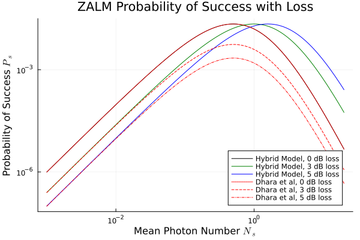
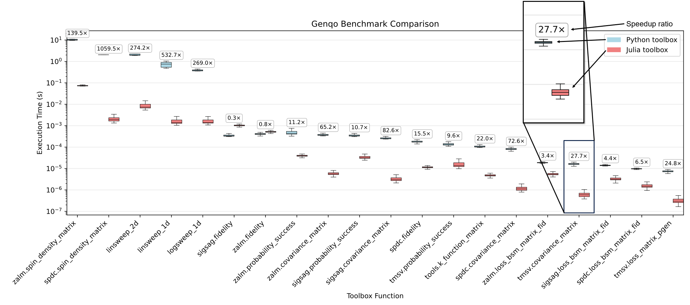

# Genqo.jl: Entanglement Source Modeling in Python and Julia

To cite Genqo, please use this DOI:

[](https://doi.org/10.5281/zenodo.17214019)

**Contents**
- [Why Genqo?](#why-genqo)
- [Installation](#installation)
- [Quickstart](#quickstart)

## Why Genqo?
Genqo is an open-source tool for modeling quantum entanglement sources such as SPDC and ZALM. Genqo uses a hybrid Gaussian/non-Gaussian framework that avoids truncating the quantum state with a low mean photon number approximation. This allows the hybrid approach, unlike comparable perturbative approaches, to predict performance metrics accurately beyond the $N_s \approx 0.2$ mean photon number regime (see below).

<div align="center">



*Comparison of the hybrid ZALM model to analytical models using the low mean photon number approximation. Divergence of hybrid model from truncated models is evident after Ns = 0.2.*

</div>

Genqo allows for calculation of performance metrics such as entanglement rate, fidelity, and full density operators while sweeping mean photon number, dark counts, and various device and transmission losses. Thanks to Julia's JIT compilation feature, these metrics can be computed up to three orders of magnitude (140-1000x) faster than in Genqo's original Python implementation.

<div align="center">



*Comparison of Genqo benchmarks before and after moving to Julia implementation.*

</div>

Genqo.jl allows for simple integration with the full-stack quantum networking testbed [QuantumSavory.jl](https://github.com/QuantumSavory/QuantumSavory.jl), or usage as a standalone Python package through the Python wrapper.

## Installation

Genqo.jl is coming soon to the Julia package registry and to PyPi. Until then, the best way to use this new, fast Genqo is to clone this repository and build from source.

1. [Install Julia](https://julialang.org/downloads/)
2. Run the following commands in a terminal:

```bash
git clone https://github.com/JacobGunnell/Genqo.jl
cd Genqo.jl
julia --project=.
```

3. In the Julia window, run `using Pkg; Pkg.instantiate()` to install the required dependencies. Now simply type `using Genqo` to import the Genqo package!

## Quickstart

Try running the [tutorial notebook](tutorial/hybrid_model_jl.ipynb) for an introduction to Genqo.jl's structure and functionality.

## Contact

Please reach out at jacob.r.gunnell@gmail.com with any questions or ideas.
